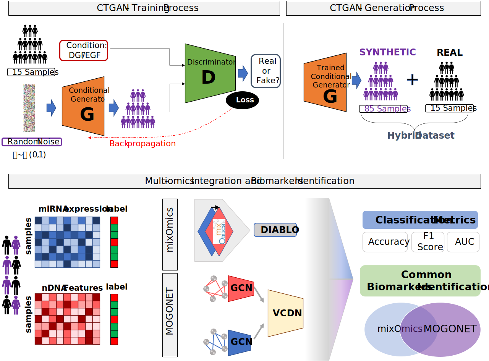

# PROMISED
PROMISED: Prediction of Renal Outcome using Multiomics and Integrated Statistical Evaluation of Delayed Graft Function in kidney transplant recipients.

<div align="left">
<br/>
<p align="center">
</img>
</p>
</div>

</div>

## Installation and Dependencies

This repository is tested under the following system settings:
- `Python 3.7.9` (is recommended to create a `venv`)

Clone this repository from Github

```cmd
git clone https://github.com/ginTom/PROMISED.git
```
#### CTGAN
- Install Python dependencies for CTGAN project

```cmd
pip install -r CTGAN_requirements.txt
```
#### MOGONET
Clone MOGONET repository from Github and install dependencies

```cmd
git clone https://github.com/txWang/MOGONET.git
pip install -r MOGONET_requirements.txt
```
## mixOmics
Install the mixOmics package from Bioconductor; you may need to install the latest R version and the latest BiocManager package installed.
```R
## install BiocManager if not installed 
if (!requireNamespace("BiocManager", quietly = TRUE)) {
  install.packages("BiocManager")}
## install mixOmics 
BiocManager::install('mixOmics')
```

## SNP features selection
A logistic regression (LR) model with recursive feature elimination (RFE) was fitted on SNPs data to select the first 100 discriminant features using `sklearn` python package

```python
snp_path = 'path/to/snp/data'
snp_data = pd.read_csv(snp_path)
snp_label = snp_data['class']
snp_data.drop(columns=["class"], inplace=True)

model = LogisticRegression()
rfe = RFE(model, n_features_to_select=100)
fit = rfe.fit(snp_data, snp_label)
```

## Prepare training data
Launch `CTGAN_main.py` to generate and obtain training data for each omic:
```cmd
python CTGAN_main.py
```
- `label_tr.csv`: labels for trainin set
- `label_te.csv`: labels for test set
- `{1,2}_featname.csv`: feature names for each omic
- `{1,2}_tr.csv`: traing data
- `{1,2}_te.csv`: test data

# MOGONET
Create folder with all training data;
Customize `data_folder` and `view_list` in `MOGONET/main_mogonet.py`

## Biomarkers identification
Customize `data_folder` and `view_list` in `MOGONET/main_biomarker.py`

# mixOmics
Launch `DGF_mixomics.R` to get all results from DIABLO model
